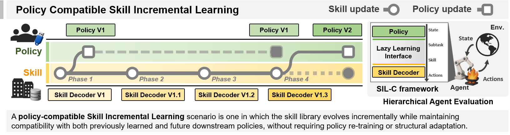
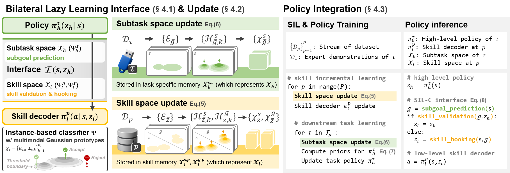
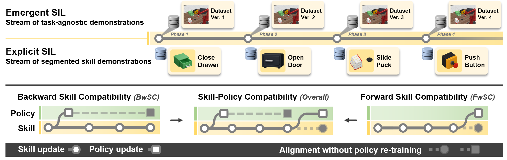

# [NeurIPS 2025 Spotlight] Policy Compatible Skill Incremental Learning via Lazy Learning Interface

Official implementation of **SIL-C** (Skill Incremental Learning with Compatibility) framework in the paper. This codebase provides the reference implementation for the continual skill learning framework.

[](https://openreview.net/forum?id=xmYT1JqVpj)
[](https://arxiv.org/abs/2509.20612)
[](https://www.python.org/downloads/release/python-31212/)
[](https://opensource.org/licenses/MIT)

\# Skill Incremental Learning \# skill-policy compatibility  \# NeurIPS 2025 Spotlight

---

## Overview

<p align="center">
  
</p>

SIL-C addresses a critical challenge in skill incremental learning: as agents acquire new skills, improvements to these skills can disrupt compatibility with existing task policies, limiting their reusability across diverse data streams. The framework employs a **bilateral lazy learning interface** to dynamically align subtask spaces with skill spaces without requiring policy retraining, enabling continuous skill refinement while maintaining seamless integration with existing policies.


### Method

<p align="center">
  
</p>

**Implementation Overview:**
✨ **Three-Tier Architecture**: Task Policy → Skill Interface → Skill Decoder
1. **Skill Representation**: Skills are represented using trajectory information from the streamed dataset, segmented into distinct skill groups via unsupervised clustering and encoded as skill prototypes.

2. **Trajectory Matching**: To match a given subtask with a suitable skill, we compute trajectory similarity through an instance-based classification process that aligns subtask prototypes with skill prototypes, determining executability via distance metrics and out-of-distribution rejection.

3. **Instance-based Classifiers for Lazy Learning Interface**: Due to the unpredictability of future tasks and the high variability of behavior, learning a generalizable mapping function is challenging. To address this, we avoid irreversible updates and instead use a lazy learning approach with bilateral instance-based classifiers. For efficiency, each skill's trajectory is compressed into skill prototypes derived from sub-clusters (e.g., selecting subgoal states closest to the average across transitions), enabling the similarity estimation to be reformulated as instance-based classification with dynamic alignment.

---

## Related Work

This work is motivated by **IsCiL** (Incremental Skill Continual Learning), which addresses skill sharing in the SIL scenario. While IsCiL focuses on learning shared skills across tasks, **SIL-C takes a different approach by addressing policy compatibility** - ensuring that incrementally learned skills remain compatible with task policies as the agent receives multiple diverse data streams. For more details on IsCiL and the relationship between these approaches, please refer to the [IsCiL](https://github.com/L2dulgi/IsCiL).

---

## Repository Structure

```
SILGym/
├── src/SILGym/           # Core package modules
│   ├── config/           # Experiment and scenario configurations
│   ├── datasets/         # Dataset loaders and processors
│   ├── models/           # Task policy, skill interface, and decoder models
│   ├── trainer/          # Training orchestration
│   └── utils/            # Logging, metrics, and utilities
├── exp/                  # Experiment scripts and configurations
│   ├── trainer.py        # Main training script
│   ├── scripts/          # Shell scripts (trainer.sh, replicate.sh)
│   └── README.md         # 📖 Comprehensive trainer documentation
├── setup/                # Installation and setup scripts
│   ├── setup.sh          # Main environment setup (integrated)
│   ├── download_dataset.sh    # Dataset download utility
│   └── setup_remote_env.sh    # Remote environment setup
├── remoteEnv/            # Remote MuJoCo evaluation servers
│   ├── kitchen/          # D4RL Kitchen server (port 9999)
│   └── multiStageMetaworld/  # MMWorld server (port 8888)
├── devtest/              # Pytest test suites
├── logs/                 # Experiment artifacts (auto-generated)
└── docs/                 # Documentation and guides
```

---

## Prerequisites

- Linux or macOS with **CUDA-capable GPU**
- [Conda](https://docs.conda.io/en/latest/miniconda.html) 23.5+ or Mambaforge
- Python 3.12.12 (default) or 3.10.16 (legacy mode)
- [MuJoCo 2.1.0](https://github.com/google-deepmind/mujoco) installed at `~/.mujoco/mujoco210`
- NVIDIA driver with EGL rendering support
- `git`, `gdown`, and build tools (`build-essential`, `cmake`, `patchelf`)

---

## Environment Variables

Add these to your `~/.bashrc`:

```bash
export LD_LIBRARY_PATH=$LD_LIBRARY_PATH:$HOME/.mujoco/mujoco210/bin
export LD_LIBRARY_PATH=$LD_LIBRARY_PATH:/usr/lib/nvidia
export MUJOCO_GL=egl
export XLA_PYTHON_CLIENT_PREALLOCATE=false
```

Then reload: `source ~/.bashrc`

---

## Installation

### 🚀 Quick Setup (Recommended)

> **⚠️ Important**: Make sure to configure [Environment Variables](#environment-variables) before running the setup script.

The easiest way to get started is using our automated setup script:

```bash
bash setup.sh -y -d -r
```

This single command will:
1. ✅ Create `silgym12` conda environment (Python 3.12.12)
2. ✅ Install all dependencies including JAX/Flax
3. ✅ Install RAPIDS cuML for GPU acceleration
4. ✅ Download datasets from Google Drive (~4GB)
5. ✅ Setup remote evaluation environments (Kitchen, MMWorld)

**Options:**
```bash
bash setup.sh              # Interactive setup with prompts
bash setup.sh -y           # Skip all confirmations
bash setup.sh -d           # Include dataset download
bash setup.sh -r           # Setup remote environments
bash setup.sh --legacy     # Use Python 3.10.16 (legacy mode)
bash setup.sh -y -d -r     # Full automated setup
```

### 🔧 Step-by-Step Setup

If you prefer manual installation:

```bash
# 1. Install main environment
bash setup.sh

# 2. Download datasets
bash setup/download_dataset.sh

# 3. Setup remote evaluation environments
bash setup/setup_remote_env.sh
```

**Note on Remote Environments:**
- **Kitchen**: Requires separate `kitchen_eval` conda environment (Python 3.8.18)
- **MMWorld**: Requires separate `mmworld_eval` conda environment (Python 3.10.16)

The `setup/setup_remote_env.sh` script handles all remote environment installations automatically.

---

## 🎯 Interactive Demo (Highly Recommended!)

> **💡 Important**: After installation, **we strongly recommend running the interactive demo notebook**. It will help you understand how SIL-C's trajectory matching and lazy learning interface work in practice.

```bash
conda activate silgym12
jupyter notebook docs/silc_trajectory_matching_demo.ipynb
```

This demo provides:
- **Visual walkthrough** of trajectory matching process
- **Step-by-step explanation** of skill-policy alignment
- **Interactive examples** showing how the lazy learning interface works

**Running this demo will give you valuable insights into the framework and help you get started quickly!**

---

## Datasets and Environments

<p align="center">
  
</p>

### Supported Environments

| Environment | State Dim | Action Dim | Python | Conda Env | Description |
|-------------|-----------|------------|--------|-----------|-------------|
| **kitchen** | 60 | 9 | 3.8.18 | `kitchen_eval` | D4RL Kitchen tasks |
| **mmworld** | 140 | 4 | 3.10.16 | `mmworld_eval` | Multi-stage Metaworld |

**Important:** Each environment requires its own dedicated conda environment for the evaluation server (separate from the main `silgym12` training environment).

### Dataset Download

Datasets are automatically downloaded with `setup.sh -d`, or manually:

```bash
bash setup/download_dataset.sh
```

This downloads ~4GB of trajectory data from Google Drive and extracts to:
- `data/evolving_world/` - MMWorld datasets
- `data/evolving_kitchen/` - Kitchen datasets

---

## Quick Start

### 1️⃣ Start Evaluation Server

**⚠️ Always start the server BEFORE training!**

Each environment requires a dedicated conda environment. Choose one:

```bash
# Terminal 1: Kitchen Server (Python 3.8.18)
conda activate kitchen_eval
python remoteEnv/kitchen/kitchen_server.py  # Port 9999

# OR Terminal 1: MMWorld Server (Python 3.10.16)
conda activate mmworld_eval
python remoteEnv/multiStageMetaworld/mmworld_server.py  # Port 8888
```

**Note:** The evaluation server must run in its own conda environment (e.g., `kitchen_eval` or `mmworld_eval`), separate from the training environment (`silgym12`).

### 2️⃣ Run Training

```bash
# Terminal 2: Training
conda activate silgym12

# Kitchen with PTGM
python exp/trainer.py \
  --env kitchen \
  --scenario_type kitchenem \
  --sync_type sync \
  --algorithm ptgm \
  --lifelong s20b4/append4 \
  --dec ddpm \
  --seed 0

# MMWorld with LazySI
python exp/trainer.py \
  --env mmworld \
  --scenario_type mmworldem \
  --sync_type sync \
  --algorithm lazysi \
  --lifelong ptgm/s20b4/ptgm/s20b4 \
  --dec ddpm \
  --dist_type maha \
  --seed 0
```

### 3️⃣ Using Training Script for Multiple Seeds

```bash
bash exp/scripts/trainer.sh \
  --env kitchen \
  --sc kitchenem \
  --sy sync \
  --al lazysi \
  --ll ptgm/s20b4/ptgm/s20b4 \
  --gpu 0 \
  --j 2 \
  --start_seed 0 \
  --num_exps 5 \
  --dec ddpm \
  --dist_type maha \
  --expid my_experiment
```

---

## Running Experiments

### Available Algorithms

| Algorithm | Description | Example Lifelong Strategy |
|-----------|-------------|---------------------------|
| **PTGM** | Prototype-based Task Generation | `s20b4/append4` |
| **BUDS** | Behavior Unsupervised Discovery | `er20`, `append16` |
| **IsCiL** | Incremental Skill CiL | `bases50` |
| **Imanip** | Instruction Manipulation | `tr10`, `append8` |
| **LazySI** | Lazy Skill Interface (main algorithm) | `ptgm/s20b4/ptgm/s20b4` |
| **SILC** | Refactored LazySI | Same as LazySI |

> **Note**: For detailed implementation and adaptation of baseline algorithms to our framework, please refer to the **Appendix** section of the [paper](https://openreview.net/forum?id=xmYT1JqVpj).

### Common Options

```bash
# Debug mode (quick testing)
python exp/trainer.py --debug --no_eval --env kitchen --sc kitchenem --al ptgm --ll ft

# Custom epochs
python exp/trainer.py --epoch 3000 --env kitchen --sc kitchenem --al ptgm --ll append16

# With evaluation noise (Gaussian)
python exp/trainer.py --eval_noise --eval_noise_scale 0.05

# Use Flow decoder (faster; original ddpm decoder)
python exp/trainer.py --dec fql --env kitchen --sc kitchenem --al lazysi --ll ptgm/s20b4/ptgm/s20b4
```

For complete documentation of all options, see **[exp/README.md](exp/README.md)**.

---

## Experiment Outputs

Training artifacts are saved to:

```
logs/{env}/{scenario}/sync/{algorithm}/{lifelong}/{date}seed{seed}{id}/
├── experiment_config.txt           # Configuration snapshot
├── skill_trainer.log              # Training logs
├── skills/
│   ├── decoder_pre_{phase}.pkl    # Decoder checkpoints
│   └── interface_pre_{phase}.pkl  # Interface checkpoints
├── policy/
│   └── policy_{phase}/pre_{phase}.pkl  # Policy checkpoints
└── results/
    └── phase_{phase}_eval.json    # Evaluation results
```

### Analyzing Results

```bash
python src/SILGym/utils/llmetrics.py -e kitchen -g keyword1 keyword2
```

This aggregates metrics across runs and reports:
- Success rates per phase
- Catastrophic forgetting analysis
- Transfer learning metrics
- Final performance summary

---

## Documentation

### 📚 Main Documentation

- **[exp/README.md](exp/README.md)** - 📖 **Comprehensive trainer documentation** with all options and examples
- **[CLAUDE.md](CLAUDE.md)** - Project overview and development guide
- **[docs/trainer_execution_guide.md](docs/trainer_execution_guide.md)** - Advanced configuration details
- **[docs/logging_system.md](docs/logging_system.md)** - Logging system documentation

### 🔧 Key Configuration Files

- **Algorithm Configs**: `src/SILGym/config/baseline_config.py`
- **Scenario Configs**: `src/SILGym/config/{kitchen,mmworld}_scenario.py`
- **Model Definitions**: `src/SILGym/models/`
- **Training Logic**: `src/SILGym/trainer/skill_trainer.py`

---

## Development

### Running Tests

```bash
# All tests
pytest devtest

# Smoke tests only
pytest devtest -k smoke

# Trainer tests
pytest devtest -k trainer

# Specific test
pytest devtest/test_trainer.py::test_ptgm_kitchen_debug
```

### Code Structure

The codebase follows a modular architecture:

1. **Configuration Layer** (`config/`) - Defines experiment parameters
2. **Data Layer** (`datasets/`) - Loads and processes trajectories
3. **Model Layer** (`models/`) - Implements task policy, skill interface, and decoders
4. **Training Layer** (`trainer/`) - Orchestrates multi-phase training
5. **Evaluation Layer** (`remoteEnv/`) - Remote environment servers

---

## GPU Acceleration

### cuML Support

The framework optionally uses **RAPIDS cuML** for GPU-accelerated clustering:

- **5-50x speedup** for KMeans clustering
- **10-100x speedup** for UMAP/t-SNE dimensionality reduction

Automatically installed with `setup.sh` (default mode). Check status:

```bash
python -c "from SILGym.utils.cuml_wrapper import is_cuml_available; print('cuML:', 'ENABLED' if is_cuml_available() else 'DISABLED')"
```

Manual installation:
```bash
bash setup/python12/cuml.sh
```

---

## Troubleshooting

### Common Issues

**❌ Server Connection Error**
```bash
# Ensure server is running BEFORE training
conda activate kitchen_eval
python remoteEnv/kitchen/kitchen_server.py
```

**❌ CUDA Out of Memory**
- Reduce batch size in scenario config
- Switch to flow decoder (lower memory than DDPM): `--dec fql`
- Use smaller LoRA dimension: `--lifelong append4`

**❌ Slow Training**
- Enable cuML: `bash setup/python12/cuml.sh`
- Use flow decoder: `--dec fql`
- Use debug mode for testing: `--debug`
- Reduce phase epochs: `--epoch 2500`

**❌ Import Errors**
```bash
# Reinstall in editable mode
conda activate silgym12
pip install -e .
```

**❌ MMWorld Scenario Error**
```bash
# Use correct scenario types (NOT 'easy')
--scenario_type mmworldem   
--scenario_type mmworldex  
```

For more troubleshooting, see [exp/README.md](exp/README.md#tips--troubleshooting).

---

## Citation

If you use this codebase in your research, please cite:

```bibtex
@inproceedings{lee2025policy,
  title={Policy Compatible Skill Incremental Learning via Lazy Learning Interface},
  author={Lee, Daehee and Lee, Dongsu and Kwack, TaeYoon and Choi, Wonje and Woo, Honguk},
  booktitle={Advances in Neural Information Processing Systems (NeurIPS)},
  year={2025},
}
```

### Paper Links

- 📄 **OpenReview**: https://openreview.net/forum?id=xmYT1JqVpj
- 📄 **arXiv**: https://arxiv.org/abs/2509.20612

---

## License

This project is licensed under the MIT License 

---

## Support

- **Issues**: Report bugs or request features via GitHub Issues
- **Documentation**: See [exp/README.md](exp/README.md) for detailed trainer usage

---

## Acknowledgments

This work builds upon:
- **D4RL** for Kitchen environment
- **Metaworld** for multi-task manipulation
- **JAX/Flax** for deep learning framework
- **RAPIDS cuML** for GPU-accelerated clustering

> **Note**: Vision-based environments (`kitchen_vis`, `kitchenstudio_vis`) and LIBERO integration are currently under development. See [TODO.md](TODO.md) for details.

---

## Quick Links

| Link | Description |
|------|-------------|
| [📄 Paper (OpenReview)](https://openreview.net/forum?id=xmYT1JqVpj) | Read the full paper |
| [📄 Paper (arXiv)](https://arxiv.org/abs/2509.20612) | arXiv preprint |
| [🚀 Setup Guide](#installation) | Installation instructions |
| [🎯 Interactive Demo](#-interactive-demo-highly-recommended) | **Recommended!** Visual walkthrough of SIL-C |
| [⚡ Quick Start](#quick-start) | Get started in 5 minutes |
| [📖 Trainer Docs](exp/README.md) | Complete trainer documentation |
| [🔧 Troubleshooting](#troubleshooting) | Common issues and solutions |
| [💻 Development](#development) | Contributing and development guide |
